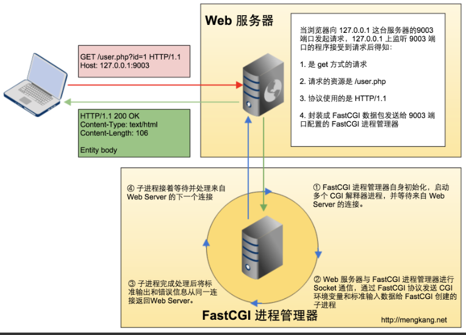
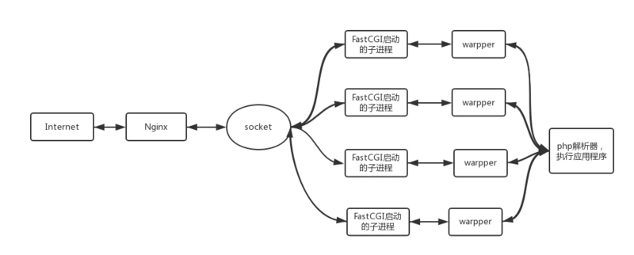

# NGINX惊群现象
https://blog.csdn.net/russell_tao/article/details/7204260

在说nginx前，先来看看什么是“惊群”？简单说来，多线程/多进程（linux下线程进程也没多大区别）等待同一个socket事件，当这个事件发生时，这些线程/进程被同时唤醒，就是惊群。

# NGINX与fpm的方式,主要是两种工作方式
tcp socket：tcp socket通信方式，需要在nginx配置文件中填写php-fpm运行的ip地址和端口号。
````
location ~ \.php$ {
    include fastcgi_params;
    fastcgi_param SCRIPT_FILENAME $document_root$fastcgi_script_name;;
    fastcgi_pass 127.0.0.1:9000;
    fastcgi_index index.php;
}
````
unix socket：unix socket通信方式，需要在nginx配置文件中填写php-fpm运行的pid文件地址。
````
//service php-fpm start生成.sock文件
location ~ \.php$ {
    include fastcgi_params;
    fastcgi_param SCRIPT_FILENAME $document_root$fastcgi_script_name;;
    fastcgi_pass unix:/var/run/php5-fpm.sock;
    fastcgi_index index.php;
}
````

# NGINX上传文件大小的限制，修改命令
client_max_body_size 10M 设置上传文件大小限制


# PHP +Nginx 默认配置，突然收到大量请求，服务器开始报错，哪个错误错误比较多 ？ 502、503、504
502 原因：php_fpm 配置文件错误，或者是接口请求有问题
503：机器维护或者暂时不可用
504：一般是NGINX配置有问题

# fpm的平滑重启过程
通过观察，可以分析出大致的平滑重启过程为：
1. master使用新配置 fork出n-1个worker及新master 
2. 新worker处理新情求，旧worker执行完退出 
3. master重新加载配置，期间使用新master接管服务 
4. master加载配置完毕，新master切换为worker工作模式 平滑重启完，master进程号并不会发生变化。

# NGINX的错误码
502 一般是fpm配置有问题。比如请求超时。max_children和request_terminate_timeout。max_children最大子进程数 超过了php-fpm 的最大响应数，就会出现502.netstat可以查看连接数。一个php-cgi消耗的内存在20M左右，php-cgi所占用的内存为20M*max_request数量。为单个请求的超时时间（request_terminate_timeout）。当数据库连接超时，或者大量请求超时的时候，会出现502.

504一般是NGINX配置有问题。Gateway Time-out。fastcgi_connect_timeout、fastcgi_send_timeout、fastcgi_read_timeout、fastcgi_buffer_size、fastcgi_buffers、fastcgi_busy_buffers_size、fastcgi_temp_file_write_size、fastcgi_intercept_errors。fgi缓冲区太小，会导致504.
或者是程序无故退出，
或者是程序执行太慢。
proxy_read_timeout 60
proxy_send_timeout 60

# 如果包含正在处理的进程，会报什么错误？【百度面试】
```
<?php
exec("sleep 5");
echo 'done';
```
会报502
>[error] 29841#0: *1646 recv() failed (104: Connection reset by peer) while         reading response header from upstream, client: 127.0.0.1, server:  localhost, request: "GET /test.php HTTP/1.1", upstream: "fastcgi://127  .0.0.1:9001 ", host: "localhost"
process_control_timeout 设置子进程接受主进程复用信号的超时时间 可以解决这个问题。如果不能保证平滑重启，就可以设定一下这个值。
# NGINX的max_requests
max_requests意味着，子进程处理多少请求之后，就会关闭。因为子进程差不多都能同时打满，同时关闭，所以会出现502的问题。默认max_request为500个。可以修改这个参数。或者增加机器的内存，修改参数。

# NGINX的负载均衡
ip hash 根据ip进行hash可以解决session问题
 ````
upstream backserver {
    ip_hash;
    server 192.168.0.14:88;
    server 192.168.0.15:80;
}
````

轮询（是默认的方式）
````
upstream backserver {
    server 192.168.0.14;
    server 192.168.0.15;
}
````

权重
````
upstream backserver {
    server 192.168.0.14 weight=3;
    server 192.168.0.15 weight=7;
}
````

fair 根据响应时间来进行分配，响应时间短的优先分配。
````
upstream backserver {
    server server1;
    server server2;
    fair;
}
````


# nginx与fpm通信（php fpm进程master进程和worker进程分别的责任是什么）
动态程序，将请求发送给php-fpm, fpm的master启动worker去执行phpcgi，然后将编译结果返回
fcgi执行原理
1. Web Server启动时载入FastCGI进程管理器(IIS ISAPI或Apache Module)。
2. FastCGI进程管理器自身初始化，启动多个CGI解释器进程(可见多个php-cgi)并等待来自Web Server的连接。
3. 当客户端请求到达Web Server时，FastCGI进程管理器选择并连接到一个CGI解释器。Web server将CGI环境变量和标准输入发送到FastCGI子进程php-cgi。
4. FastCGI子进程完成处理后将标准输出和错误信息从同一连接返回Web Server。当FastCGI子进程关闭连接时，请求便告处理完成。FastCGI子进程接着等待并处理来自FastCGI进程管理器(运行在Web Server中)的下一个连接。 而在CGI模式中，php-cgi在此便退出了。
在上述情况中，你可以想象CGI通常有多慢。每一个Web 请求PHP都必须重新解析php.ini、重新载入全部扩展并重初始化全部数据结构。使用FastCGI，所有这些都只在进程启动时发生一次。一个额外的好处是，持续数据库连接(Persistent database connection)可以工作。

FastCGI 与传统 CGI 模式的区别之一则是 Web 服务器不是直接执行 CGI 程序了，而是通过 Socket 与 FastCGI 响应器（FastCGI 进程管理器）进行交互，也正是由于 FastCGI 进程管理器是基于 Socket 通信的，所以也是分布式的，Web 服务器可以和 CGI 响应器服务器分开部署。Web 服务器需要将数据 CGI/1.1 的规范封装在遵循 FastCGI 协议包中发送给 FastCGI 响应器程序。

# cgi协议流程
客户端访问 http://127.0.0.1:9003/cgi-bin/user?id=1
127.0.0.1 上监听 9003 端口的守护进程接受到该请求
通过解析 HTTP 头信息，得知是 GET 请求，并且请求的是 /cgi-bin/ 目录下的 user 文件。
将 uri 里的 id=1 通过存入 QUERY_STRING 环境变量。
Web 守护进程 fork 一个子进程，然后在子进程中执行 user 程序，通过环境变量获取到id。
执行完毕之后，将结果通过标准输出返回到子进程。
子进程将结果返回给客户端。
# fpm
fpm的master通过【共享内存】与worker进行通信，同时监听worker 的状态，已处理请求数。要杀死一个worker通过发送信号的方式来实现。
fpm的master进程与worker进程之间不会直接进行通信，master通过共享内存获取worker进程的信息，比如worker进程当前状态、已处理请求数等，当master进程要杀掉一个worker进程时则通过发送信号的方式通知worker进程。



# fpm进程管理
介绍下三种不同的进程管理方式：
1. static: 这种方式比较简单，在启动时master按照pm.max_children配置fork出相应数量的worker进程，即worker进程数是固定不变的
2. dynamic: 动态进程管理，首先在fpm启动时按照pm.start_servers初始化一定数量的worker，运行期间如果master发现空闲worker数低于pm.min_spare_servers配置数(表示请求比较多，worker处理不过来了)则会fork worker进程，但总的worker数不能超过pm.max_children，如果master发现空闲worker数超过了pm.max_spare_servers(表示闲着的worker太多了)则会杀掉一些worker，避免占用过多资源，master通过这4个值来控制worker数
3. ondemand: 这种方式一般很少用，在启动时不分配worker进程，等到有请求了后再通知master进程fork worker进程，总的worker数不超过pm.max_children，处理完成后worker进程不会立即退出，当空闲时间超过pm.process_idle_timeout后再退出

worker会将自己的状态更新到fpm_scoreboard_proc_s->request_stage，master就是通过这个字段来判断worker是否是空闲。

# PHP的四种工作模式
1. cgi 通用网关接口（Common Gateway Interface）
1. fast-cgi 常驻（long-live）型的 CGI
1. cli  命令行运行   （Command Line Interface）
1. mod_php模式 （apache等web服务器运行的模块模式）

# 遇到过一个问题，开多少进程合适？曾经被问了两遍。
各位可以补充下，这个问题，应该是去看自己的硬件资源来决定。


