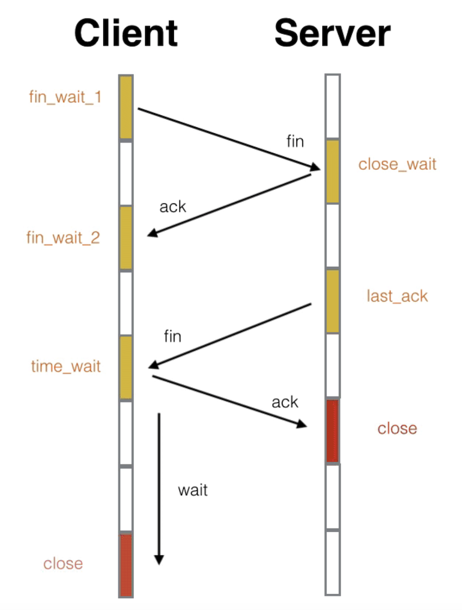
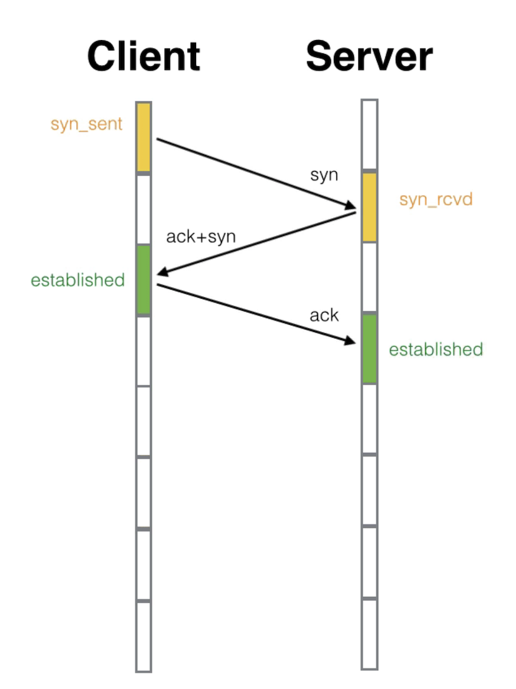

# 关闭TCP连接
第一次分手：主机1（可以使客户端，也可以是服务器端），设置Sequence Number和Acknowledgment Number，向主机2发送一个FIN报文段；此时，主机1进入FIN_WAIT_1状态；这表示主机1没有数据要发送给主机2了；

第二次分手：主机2收到了主机1发送的FIN报文段，向主机1回一个ACK报文段，Acknowledgment Number为Sequence Number加1；主机1进入FIN_WAIT_2状态；主机2告诉主机1，我"同意"你的关闭请求；进去close_wait状态
第三次分手：主机2向主机1发送FIN报文段，请求关闭连接，同时主机2进入LAST_ACK状态；

第四次分手：主机1收到主机2发送的FIN报文段，向主机2发送ACK报文段，然后主机1进入TIME_WAIT状态；主机2收到主机1的ACK报文段以后，就关闭连接；此时，主机1等待2MSL后依然没有收到回复，则证明Server端已正常关闭，那好，主机1也可以关闭连接了。就是CLOSED状态。



# 建立TCP连接
第一次握手：建立连接。客户端发送连接请求报文段，将SYN位置为1，Sequence Number为x；然后，客户端进入SYN_SEND状态，等待服务器的确认；

第二次握手：服务器收到SYN报文段。服务器收到客户端的SYN报文段，需要对这个SYN报文段进行确认，设置Acknowledgment Number为x+1(Sequence Number+1)；同时，自己还要发送SYN请求信息，将SYN位置为1，Sequence Number为y；服务器端将上述所有信息放到一个报文段（即SYN+ACK报文段）中，一并发送给客户端，此时服务器进入SYN_RECV状态；

第三次握手：客户端收到服务器的SYN+ACK报文段。然后将Acknowledgment Number设置为y+1，向服务器发送ACK报文段，这个报文段发送完毕以后，客户端和服务器端都进入ESTABLISHED状态，完成TCP三次握手。


# HTTP会慢吗？
使用ssl通信会比较慢，因为涉及CPU和内存消耗，需要加密解密；并不是所有的通信都需要加密；有些公司会觉得购买证书不划算，会不采用https。


# TCP 粘包如何解决？
TCP粘包是指发送方发送的若干包数据到接收方接收时粘成一包，从接收缓冲区看，后一包数据的头紧接着前一包数据的尾。

如何解决：

（1）发送方

对于发送方造成的粘包现象，我们可以通过关闭Nagle算法来解决，使用TCP_NODELAY选项来关闭Nagle算法。

（3）应用层处理

应用层的处理简单易行！并且不仅可以解决接收方造成的粘包问题，还能解决发送方造成的粘包问题。解决方法就是循环处理：应用程序在处理从缓存读来的分组时，读完一条数据时，就应该循环读下一条数据，直到所有的数据都被处理；但是如何判断每条数据的长度呢？两种途径：

1）格式化数据：每条数据有固定的格式（开始符、结束符），这种方法简单易行，但选择开始符和结束符的时候一定要注意每条数据的内部一定不能出现开始符或结束符；

2）发送长度：发送每条数据的时候，将数据的长度一并发送，比如可以选择每条数据的前4位是数据的长度，应用层处理时可以根据长度来判断每条数据的开始和结束。

# 堆栈
栈  是由操作系统来分配的。存放函数的参数，局部变量。其操作方式类似于数据结构中的栈。

堆，一般是由程序员分配，若程序员不分配，可能由OS收回。

# RESTful 是什么

看url就知道要干什么。

看method就知道要干什么

看状态码就知道结果怎么样

# HTTP 与 HTTPS 区别

HTTP 明文传输，数据都是未加密的，安全性较差，HTTPS（SSL+HTTP） 数据传输过程是加密的，安全性较好。

使用 HTTPS 协议需要到 CA（Certificate Authority，数字证书认证机构） 申请证书，一般免费证书较少，因而需要一定费用。证书颁发机构如：Symantec、Comodo、GoDaddy 和 GlobalSign 等。
HTTP 页面响应速度比 HTTPS 快，主要是因为 HTTP 使用 TCP 三次握手建立连接，客户端和服务器需要交换 3 个包，而 HTTPS除了 TCP 的三个包，还要加上 ssl 握手需要的 9 个包，所以一共是 12 个包。
http 和 https 使用的是完全不同的连接方式，用的端口也不一样，前者是 80，后者是 443。
HTTPS 其实就是建构在 SSL/TLS 之上的 HTTP 协议，所以，要比较 HTTPS 比 HTTP 要更耗费服务器资源。
# TIME-WAIT 是什么，为什么必须等待 2MLS
TIME-WAIT 是一种 TCP 状态。等待 2MLS 可以保证客户端最后一个报文段能够到达服务器，如果未到达，服务器则会超时重传连接释放报文段，使得客户端、服务器都可以正常进入到 CLOSE(关闭) 状态
# cookie、session的联系和区别，多台web服务器如何共享session？
cookie在客户端保存状态，session在服务器端保存状态。但是由于在服务器端保存状态的时候，在客户端也需要一个标识，所以session也可能要借助cookie来实现保存标识位的作用。

cookie包括名字，值，域，路径，过期时间。路径和域构成cookie的作用范围。cookie如果不设置过期时间，则这个cookie在浏览器进程 
存在时有效，关闭时销毁。如果设置了过期时间，则cookie存储在本地硬盘上，在各浏览器进程间可以共享。

session存储在服务器端，服务器用一种散列表类型的结构存储信息。当一个连接建立的时候，服务器首先搜索有没有存储的session id，如果没有，则建立一个新的session，将session id返回给客户端，客户端可以选择使用cookie来存储session id。也可以用其他的方法，比如服务器端将session id附在URL上。

区别：

(1).cookie在本地，session在服务器端。

(2).cookie不安全，容易被欺骗，session相对安全。

(3).session在服务器端，访问多了会影响服务器性能。

(4). cookie有大小限制，为3K。多服务器共享session可以尝试将session存储在memcache或者redis中。

# cookie 的作用：
会话状态管理

个性化推荐

浏览器行为追踪。

domain决定了哪些主机可以使用cookie

path决定了哪些端口可以使用cookie。
# http协议中的post和get有何区别？

GET用于获取信息，不应该用于修改信息，pOST可用于更新修改信息。

GET可传输数据大小和URL有关，而pOST没有限定大小，大小和服务器配置有关。

GET放在URL中，因此不安全，而pOST传输数据对于用户来说是不可见的，所以相对安全。

在ajax: post不被缓存，get被缓存所以一般在请求结尾加Math.random();

SERVER端接受:因为在submit提交的时候是按不同方式进行编码的，所以服务端在接受的时候会按照不同的方式进行接受!

编码方式:如果传递数据是非-ASCII,那么GET一般是不适应的，所以在传递的时候会做编码处理!
# 说一下熟悉的 http 状态码和其代表的意义
200 : 请求成功，请求的数据随之返回。

301 : 永久性重定向。

302 : 暂时行重定向。

401 : 当前请求需要用户验证。

403 : 服务器拒绝执行请求，即没有权限。

404 : 请求失败，请求的数据在服务器上未发现。

500 : 服务器错误。一般服务器端程序执行错误。

501 ：服务器不支持当前请求所需要的某个功能。当服务器无法识别请求的方法，并且无法支持其对任何资源的请求。

502: 一般是fpm出问题了

503 : 服务器临时维护或过载。这个状态时临时性的。

504：一般是NGINX配置有问题。
#  TCP和UDP
udp是非面向连接的，尽量保证数据交付，非按顺序到达。头部开销小，实现简单
1. 源端口号
2. 目的端口号
3. udp长度
4. udp校验和


tcp是面向连接的，能保证不丢失数据。流量控制，阻塞控制。提供可靠的数据服务。一对一。

tcp头部字段：
1. 源端口号，目的端口号
2. 序号
3. 确认 序号
4. ack 确认字段
5. psh 是否立即发往顶层
6. rst 是否重发
7. syn 序列号
8. fin 关闭
9. 窗口大小
10. 校验和


#  https的建立连接过程
1. 服务器端将自己的公钥发送到CA，然后CA通过数字加密服务器的公钥，然后生成公钥证书，返回给服务器
2. 服务器端将公钥证书发送给客户端
3. 客户端拿公钥证书去CA进行验证， 如果验证通过获取公钥。
4. 客户端通过公钥加密自己生成的对称加密的秘钥，然后发送给服务器。
5. 服务器通过自己的私钥进行解密获取秘钥。
6. 双方通过对称加密进行通信。

#  什么是cdn
是内容、分发、网络。主要是保存的静态资源。
全局负载均衡（Global Sever Load Balance）一般简称为 GSLB，它是 CDN 的“大脑”  他会选择一个最佳的节点，然后提供服务，他的任务就是选择一个最佳的节点。对整个cdn网络进行负载均衡。

加入cdn后，dns返回的不是服务器的ip，而是gslb的地址。因为dns没有拿到ip，就去请求gslb，进入他的全局负载均衡里面。

- 看用户的 IP 地址，查表得知地理位置，找相对最近的边缘节点；
- 看用户所在的运营商网络，找相同网络的边缘节点；
- 检查边缘节点的负载情况，找负载较轻的节点；
其他，比如节点的“健康状况”、服务能力、带宽、响应时间等。

命中率就是 命中次数和所有访问次数之比。回源率就是回源次数和所有访问次数之比。

CDN 发展到现在已经有二十来年的历史了，早期的 CDN 功能比较简单，只能加速静态资源。随着这些年 Web 2.0、HTTPS、视频、直播等新技术、新业务的崛起，它也在不断进步，增加了很多的新功能，比如 SSL 加速、内容优化（数据压缩、图片格式转换、视频转码）、资源防盗链、WAF 安全防护等等。

#  状态码499　
可以看到，499对应的是 “client has closed connection”。这很有可能是因为服务器端处理的时间过长，客户端“不耐烦”了。
测试nginx发现如果两次提交post过快就会出现499的情况，看来是nginx认为是不安全的连接，主动拒绝了客户端的连接.

      在google上搜索到一英文论坛上有关于此错误的解决方法：
      proxy_ignore_client_abort on;
      Don’t know if this is safe.
      就是说要配置参数 proxy_ignore_client_abort on;
      表示代理服务端不要主要主动关闭客户端连接。

#  websocket
HTTP 的“请求 - 应答”模式不适合开发“实时通信”应用，效率低，难以实现动态页面，所以出现了 WebSocket；
WebSocket 是一个“全双工”的通信协议，相当于对 TCP 做了一层“薄薄的包装”，让它运行在浏览器环境里；
WebSocket 使用兼容 HTTP 的 URI 来发现服务，但定义了新的协议名“ws”和“wss”，端口号也沿用了 80 和 443；
WebSocket 使用二进制帧，结构比较简单，特殊的地方是有个“掩码”操作，客户端发数据必须掩码，服务器则不用；
WebSocket 利用 HTTP 协议实现连接握手，发送 GET 请求要求“协议升级”，握手过程中有个非常简单的认证机制，目的是防止误连接。

而 WebSocket 针对的是“请求 - 应答”通信模式。那么，“请求 - 应答”有什么不好的地方呢？

“请求 - 应答”是一种“半双工”的通信模式，虽然可以双向收发数据，但同一时刻只能一个方向上有动作，传输效率低。更关键的一点，它是一种“被动”通信模式，服务器只能“被动”响应客户端的请求，无法主动向客户端发送数据。

虽然后来的 HTTP/2、HTTP/3 新增了 Stream、Server Push 等特性，但“请求 - 应答”依然是主要的工作方式。这就导致 HTTP 难以应用在动态页面、即时消息、网络游戏等要求“实时通信”的领域。

# 对HTTP协议的理解。包括什么，由什么构成，怎么去发现问题。
1. 三次握手
2. 四次挥手

1. 请求头
2. 请求体
3. body

1. 请求头的方法。put， head get post 
2. 状态码 500 和501

501 Not Implemented。服务器不支持当前请求所需要的某个功能。当服务器无法识别请求的方法，并且无法支持其对任何资源的请求

cookie 和 session的区别

单点登录自己搞过么，是怎么实现的。

session共享。单点，没有自己搞过么？那有了解过么？单点登录。


# 用消息队列，解决什么问题？

# 301和302 的区别和使用场景
301 是永久重定向，比如 域名换了，浏览器更新历史记录，更新书签。或者是使用新域名，或者是使用新机器，或者是 目录结构进行了改变。

302 临时重定向，不会更新url。只是暂时不能访问。或者用来进行服务降级。

通过location 进行跳转。或者code

会浪费资源。

重复调用的话，也会增加资源的浪费，

# http的的实体
1. 数据类型，实体内容的类型是什么，主要是accept和 content-type

比如 accept: text/html, application/xml, image/png, image/webp, 告诉服务器，我可以接受这些类型的数据。

content: text/html, image/png 告诉客户端， 我返回的数据类型。
2. 数据压缩类型实体数据的压缩方式。accept-encoding, content-encoding。

accept-encoding: gzip, deflate, br

content-encoding:gzip

3. 语言类型类型。 accept-language, content-language. zh-En, zh, en 等方式

accept-language: zh-CN, en,zh

content-language:zh-CN

4.  字符集表示的编码方式。accept-charset， content-type。

accept-charset:utf-8

content-type:text/html, charset=utf-8

5. 客户端需要在accept等字段里面，跟服务器进行内容协商。要求服务器返回合适的数据。
6. accept里面可以设置权重。 用"，" 进行分隔。

# http 如何传输大文件？ 视频之类的数据如何 分段传输？
1. chucked
2. 范围传输，范围选择
```
HTTP/1.1 206 Partial Content
Content-Length: 32
Accept-Ranges: bytes
Content-Range: bytes 0-31/96
 
// this is a plain text json doc
```
Accept-Ranges 表示接受范围传输，Content-Range标识内容的范围。状态码为206

因为传输的结果里面有长度标识，所以\r\n 不会截断数据。

# X-Forwarded-For 和 X-Real-IP
而“X-Forwarded-For”追加的是请求方的 IP 地址

X-Real-IP 记录的是客户端的地址，如果只有一层代理的话。

X-Real-IP 和 X-Forwarded-For  是一致的。

# 代理的缺点
代理做做一些逻辑操作， 会影响性能，增加链路长度，增加响应时间